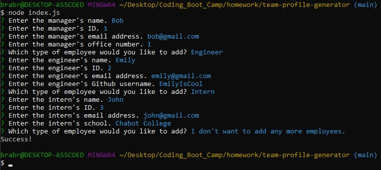
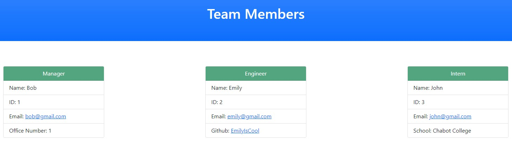

# team-profile-generator

This application is run on the command-line to generate a HTML file that is filled with information about a software engineering team.

To run the application, the user needs to run `node index.js` after installing the packages.

## Getting Started

These instructions will get you a copy of the project up and running on your local machine for development and testing purposes. See deployment for notes on how to deploy the project on a live system.

### Prerequisites

The user needs to install Node.js in order to utilize the commands to operate the application.
Instructions on how to install can be found here: [Installing Node](https://nodejs.org/en/download/)

### Installing

User needs to run `npm install` to install the `inquirer` and `jest` packages.

User can run `npm test` to test the test cases.

## Built With

* [Bootstrap CSS Framework](https://getbootstrap.com/docs/5.1/getting-started/introduction/)
* [Javascript](https://developer.mozilla.org/en-US/docs/Web/JavaScript)
* [Node.js](https://nodejs.org/en/docs/)
* [Inquirer Package](https://www.npmjs.com/package/inquirer)
* [Jest Package](https://jestjs.io/docs/getting-started)

## Video Explanation & Demonstration

The video focuses on the perspective of the user.

* [Video Demonstration](https://watch.screencastify.com/v/nZIPtvVEGNeX3CxzUz73)
* [Video Demonstration - Continued](https://watch.screencastify.com/v/SyeZBrboyfPXJUd16NZ2)

## Screenshots

* 

An example of a user running the application and filling out some team information on manager, engineer, and intern.

* 

This is the output html file from the application and how it looks shown on the browser.

## Authors

* **Bradley Le** 

- [Link to Portfolio Site](https://pentazoned.github.io/portfolio-v2/)
- [Link to Github](https://github.com/PentaZoned)
- [Link to LinkedIn](https://www.linkedin.com/in/bradley-le-/)

## License

This project is licensed under the MIT License 
